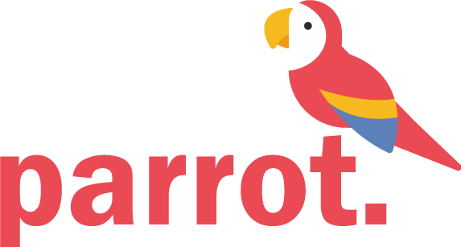
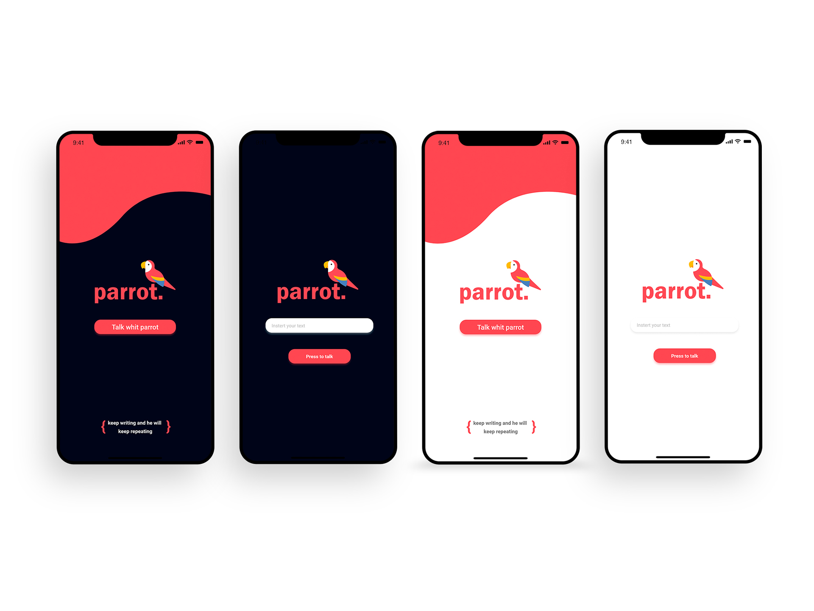

<p align="center">
	
</p>

<h4 align="center">
<br>
</h4>


## Teconologias usadas

- [Expo](https://expo.io/)
- [Speech](https://docs.expo.io/versions/latest/sdk/speech/)
- [React Native](https://reactnative.dev/)


## Instalação

Você irá precisar do expo para poder rodar todo o projeto, basta rodar o comando a seguir no seu terminal

- Expo

```bash
npm install -g expo-cli
```

- com yarn

```bash
yarn install
```

- Com npm

```bash
npm install
```


## :octocat: Rodando o projeto

para roder o projeto, é só rodar o seguinte comando

- Yarn
```bash
yarn start
```

- npm 
```bash
npm start
```


##  :writing_hand: License

Este projeto está sob a  LICENSE [MIT](https://en.wikipedia.org/wiki/MIT_License), presente no arquivo [LICENSE](./LICENSE).


---
Made by [the spanish guy](https://github.com/the-spanish-guy) with :purple_heart: